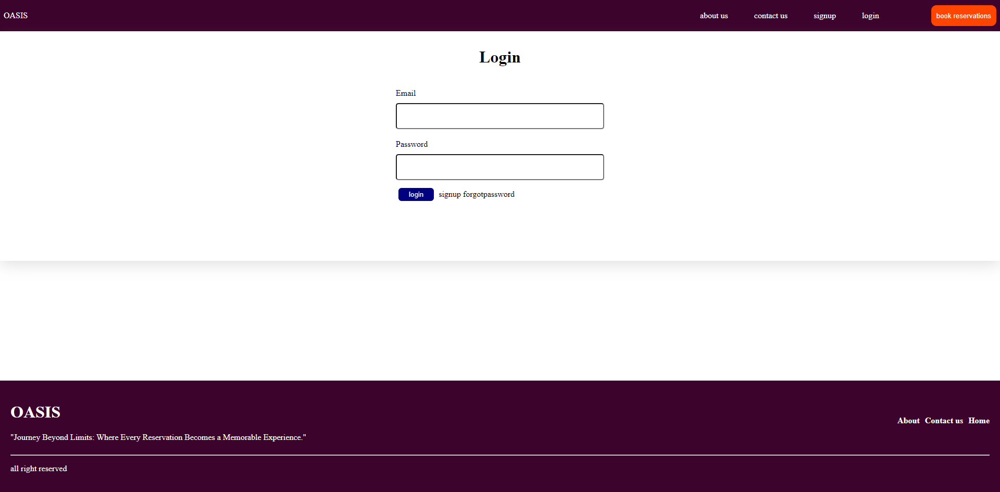
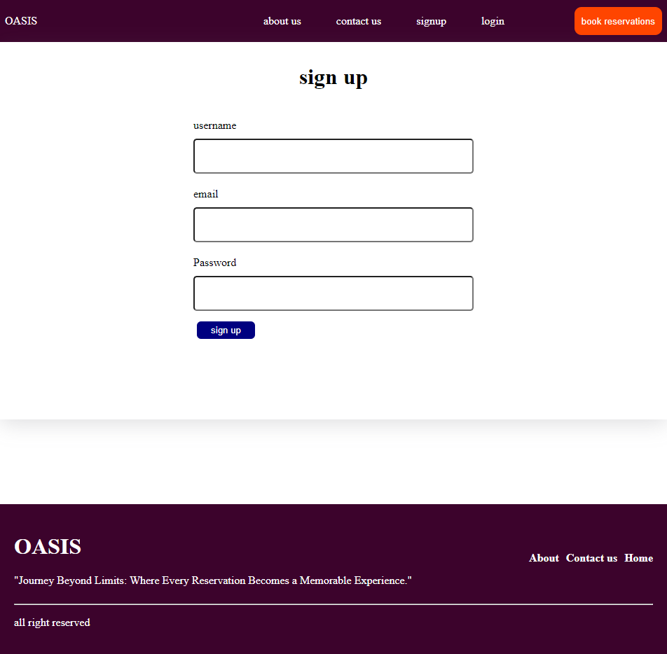
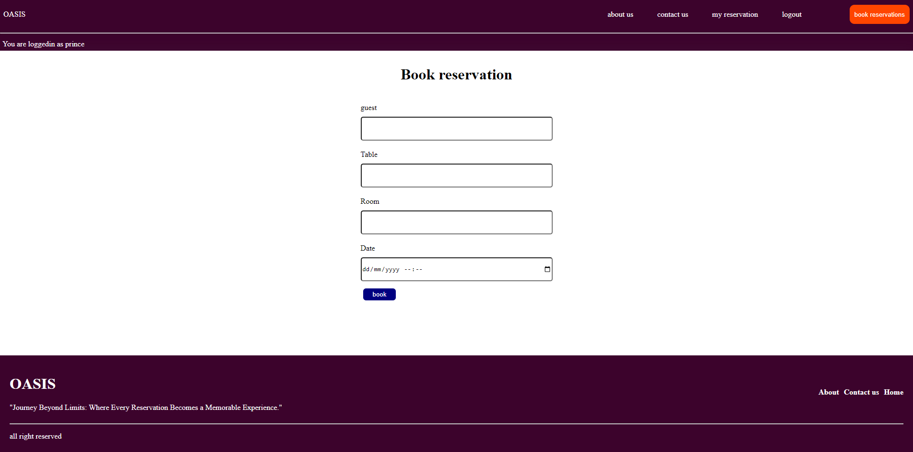
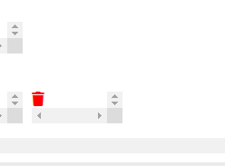
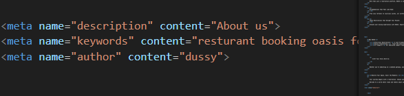
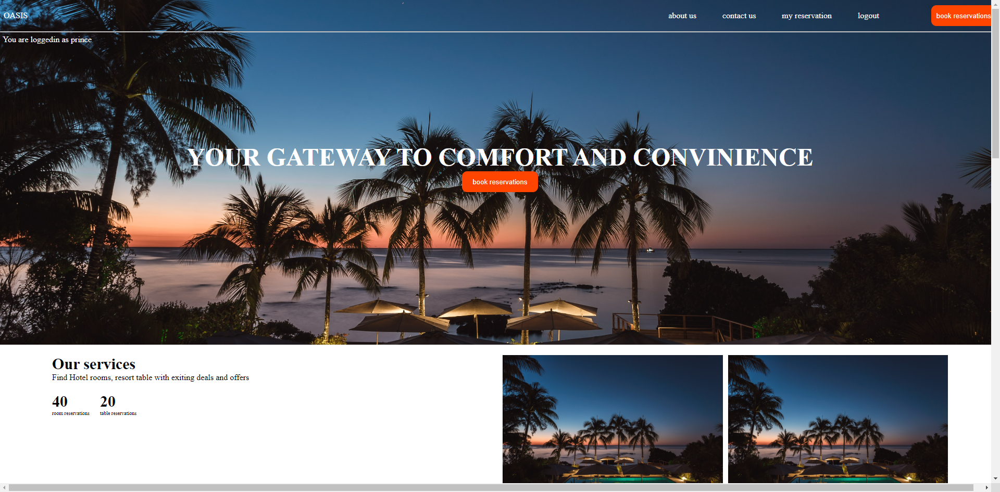
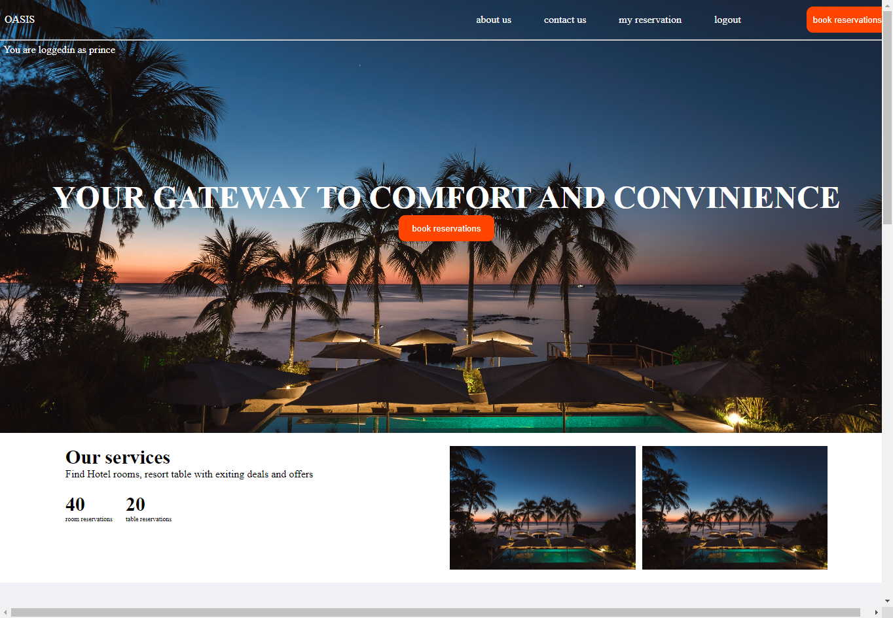

# OASIS

This project [](https://reservebooking-f88a92f8cf30.herokuapp.com/) is a minimalistic site that showcases booking reservation .

<!--  -->

# User Experience (UX)

Key information for the app
this section provides insight into the UX process, focusing on who the app is for, the main aims of the project and how the app can help users meet their needs

<!--
 -->

# Project goals:<br>

User able to book reservastions

<!--   -->
<br>

Users able to book for tables and rooms at the same

<!--  -->
<br>

Users get rervation Id after booking

# ADMIN CREDENTIALS<br>

username dussy@gmail.com <br>
email dussy@gmail.com
<br>
password Admin@123

# Features:<br>

Login
 <br>

Signup
 <br>

booking reservations
 <br>

Date and Time booking<br>
Multiple guest<br>

booking cancelations<br>
 <br>

# SEO:<br>

Implemented SEO on each page with unique

Title Tags and Meta Descriptions: Crafted unique, keyword-rich title tags and meta descriptions for each page.

Header Tags: Structured content using H1, H2, and H3 tags with target keywords.

Content Optimization: Ensured high-quality, original content that incorporated keywords naturally. Updated existing content to be more comprehensive.

 <br>

# Assumptions:<br>

all rooms and tables are the sameand have thesame size and design
<br>

There infinite numbers of rooms hence eliminating double booking
<br>

# TEST.........<br>

Model Testing:<br>

Implementing Django testing for models involves creating a structured approach to ensure that the database interactions and business logic encapsulated in your models function as expected. Here is a detailed note on how I implemented Django testing for models in a recent project:

### 1. Setting Up the Testing Environment

**Objective**: Configure the environment for writing and running tests.

- **Installed Dependencies**: Ensured `pytest-django` and `django` were included in the project's `requirements.txt` to facilitate testing.
- **Configured Settings**: Modified `settings.py` to include a separate database for testing to prevent interference with the development and production databases.

### 2. Writing Test Cases

**Objective**: Develop test cases to validate model behavior.

- **Test Suite Structure**: Created a `tests` directory within the Django app directory and added `__init__.py` to recognize it as a module.
- **Test Class**: Created test classes for each model, inheriting from `TestCase` in `django.test`.

```python
from django.test import TestCase
from eccommerce.base.models import OTP
from .models import MyModel


class TestOtpModel(TestCase):
    """
    Things to test:
    - Can create data
    - Does the __str__ method behave as expected?


    """

    @classmethod
    def setUpTestData(cls):
        cls.otp1=1234
        cls.otp2=2345
        cls.email ="janedoe@test.com"

        cls.otp = OTP.objects.create(
            email=cls.email,
            otp=cls.otp1


        )


```

### 3. Testing Model Methods

**Objective**: Ensure that custom methods on the models behave correctly.

- **Method Testing**: For models with custom methods, wrote test cases to verify their output and side effects.

```python


class TestReservationModel(TestCase):
    """
    Things to test:
    - Can be create a cart with the bare minimum of fields? (name, image and userid)
    - Does the __str__ method behave as expected?
    
    - Do two carts with the same title and user same id?
    """

    @classmethod
    def setUpTestData(cls):
        cls.user = USER_MODEL.objects.create_user(
            email='janedoe@test.com',
          
            username='user123',
            password='password456'
        )
        cls.id = randomString(12)


        cls.reservations = RESERVATIONS(resId=id,date="2024-04-21T03:59:14.474Z",room=1,table=1,email="princewillasotibe123@gmail.com")

    


    def test_reservation_str(self):
        """ Tests the __str__ of the reservation model"""

        self.assertEqual(str(self.reservation), self.reservations.username)


```

### 4. Testing Model Validations

**Objective**: Ensure that model validations are working as expected.

- **Validation Testing**: Tested the model's field validations by creating instances with invalid data and asserting that errors are raised.

```python
from django.core.exceptions import ValidationError

class MyModelValidationTestCase(TestCase):
    def test_invalid_data(self):
        obj = MyModel(name="", description="Test Description")  # Name is required
        with self.assertRaises(ValidationError):
            obj.full_clean()  # This method triggers model validation
```

### 5. Testing Database Constraints

**Objective**: Validate that database constraints (e.g., unique constraints) are enforced.

- **Constraint Testing**: Checked for the enforcement of unique constraints and other database-level validations.

```python
class MyModelConstraintTestCase(TestCase):
    def test_unique_constraint(self):
        MyModel.objects.create(name="Unique Name", description="Description 1")
        with self.assertRaises(Exception):  # Could be IntegrityError depending on the database
            MyModel.objects.create(name="Unique Name", description="Description 2")
```

### 6. Running the Tests

**Objective**: Execute the tests to verify model functionality.

- **Command**: Used Django’s built-in test runner to run the test suite.

```bash
python manage.py test
```

- **Pytest**: Alternatively, used `pytest` for running tests to leverage its advanced features and more readable output.

```bash
pytest
```

### Conclusion

By implementing these structured steps for testing Django models, I ensured robust validation of model behaviors, including data integrity, business logic, and database constraints. This process not only helped in catching bugs early but also maintained a high standard of code reliability and quality throughout the development lifecycle.

# TEST.........<br>

# Responsiveness<br>

screen w-1700
 <br>

screen w-1500
 <br>

screen w-600
 <br>

# Deployment<br>

```make a new file name Procfile and do not put any extension in it. It is a file required by Heroku

. For our app we can write the following command "web: gunicorn name_of_your_app.wsgi -log-file -" in the procfile

. pip install gunicorn

. login into heroku in the browser

. Make a new heroku app

. update settings.py file ALLOWED_HOSTS = ["your_app_name.herokuapp.com"]

. With a couple of lines of config WhiteNoise allows your web app to serve its own static files, making it a self-contained unit that can be deployed anywhere without relying on nginx, Amazon S3 or any other external service

so run pip install whitenoise


Add it in MIDDLEWARE in settings.py file

MIDDLEWARE = [
   'django.middleware.security.SecurityMiddleware',
  'whitenoise.middleware.WhiteNoiseMiddleware',
   ...
]

.Make a new Github Repo and add all of your code in it.

.Using Heroku Postgres
Go to your app dashboard and in the Resources section search for Postgres and click add.


. Now paste the following code below DATABASES in settings file

db_from_env = dj_database_url.config(conn_max_age=600)
DATABASES['default'].update(db_from_env)


.Currently, your database is empty and you might want to fill it.

Open terminal
type → heroku login
After the login run the following commands
heroku run python manage.py makemigrations
heroku run python manage.py migrate ...

# Credits<br>
Full credit goes to code institute for the template provided to make this project a possiblityl


```
